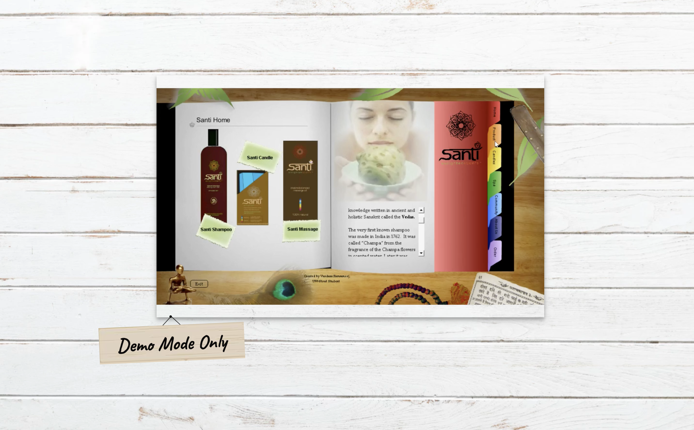
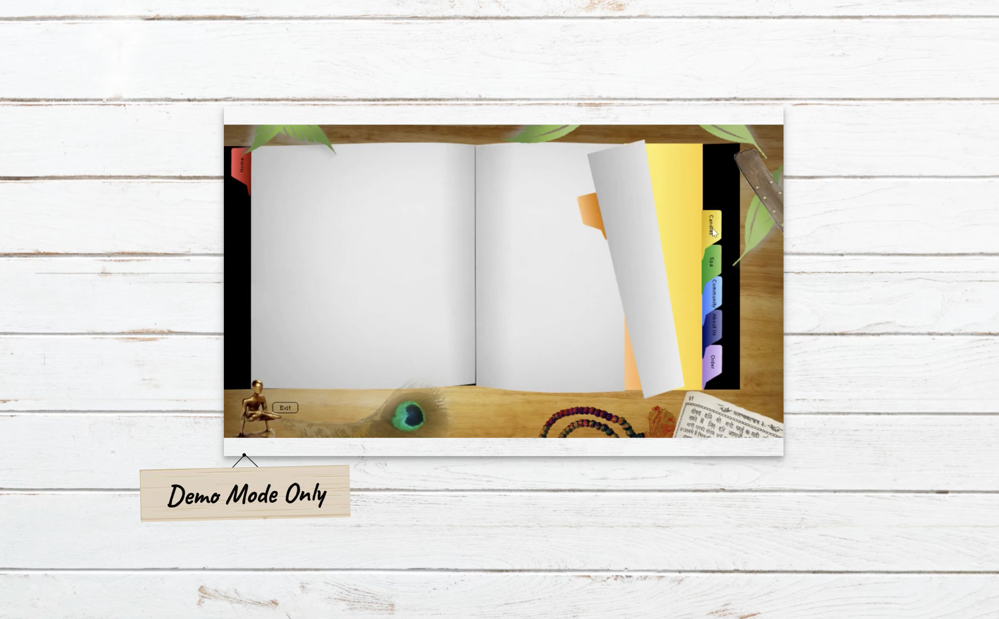

# The Santi Project
Demo of Marketing Literature (Please Note: This is not the actual app but only a video Demo.)

#### Technologies Utilized
* Adobe Photoshop
* Adobe Illustrator 
* Created SVG images that animate.
  
  

#### Feature 1: The company logo is an SVG image and is animated.

#### Feature 2: Tabs animates when the user clicks on different tab colors. It appears to flip each page. 

#### Feature 3: The goji berry plant grows through animation. The user is able to click on each goji berry to learn more about the plant. 

#### Feature 4: The pineapple grows through animation. The user is also able to use the scroll bar to view all material.
